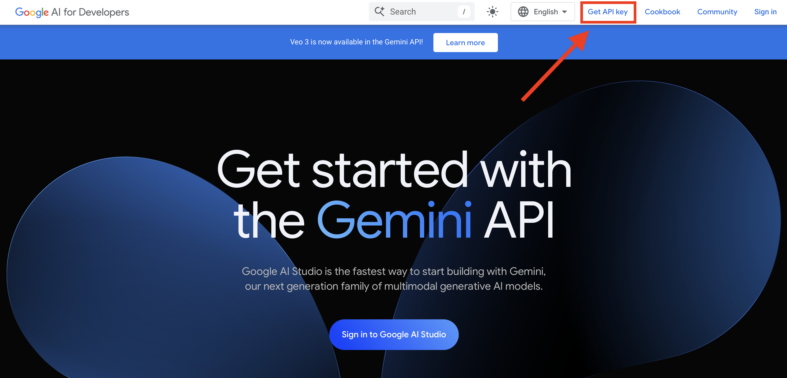
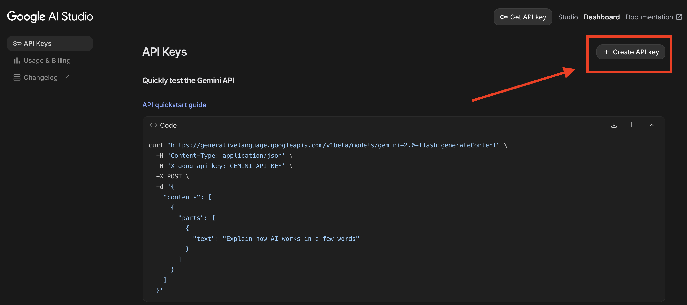

# GeneMind

**GeneMind** is a pipeline that leverages large language models (LLMs) to analyze a given group of genes within a specific research context.  

This project was made in 1 day during the VIB Machine Learning and AI Summer School 2025.

## Installation (Linux)

GeneMind requires the **UV package manager**. You can install it following the instructions [here](https://docs.astral.sh/uv/#installation).  

Clone the repository and set up the environment:

```bash
git clone https://github.com/ErwannCnl/genemind
cd genemind 
uv python pin 3.11
uv sync
source .venv/bin/activate
```
### Getting Gemini API key
Genemind uses Gemini 2.5 as LLM. You need an API key to connect to the LLM hosted by Google.

Google offers the possibility to use its Gemini models for free within a certain quota. To consult the quota see [here](https://ai.google.dev/gemini-api/docs/rate-limits).

In order to use the Gemini API, however, you need to get an API key. To get the API key, you need to go to [Google AI Studio](https://ai.google.dev/aistudio) and click the "Get API key"



Then by clicking the "Create API key" button you will be able to generate a new API key. Save it in a safe place.



### Verify that the API key is working

Use the command from Gemini API documentation to verify that the API key is working. Replace `GEMINI_API_KEY` on line 3 with your obtained API key.

```bash
curl "https://generativelanguage.googleapis.com/v1beta/models/gemini-2.0-flash:generateContent" \
  -H 'Content-Type: application/json' \
  -H 'X-goog-api-key: GEMINI_API_KEY' \
  -X POST \
  -d '{
    "contents": [
      {
        "parts": [
          {
            "text": "Explain how AI works in a few words"
          }
        ]
      }
    ]
  }'
```

Create in the root of this cloned project a new file called `.env` with your google API key by typing:

```
echo "GOOGLE_API_KEY=YOUR_API_KEY" > .env
```

## Usage
```bash
uv run main.py "your prompt as free text"
```
### Prompt Guidelines:
Make sure your prompt includes:
- Gene list
- Organism
- How the data was obtained
- Research context
- OPTIONAL: Desired analysis (currently only GSEA is supported)


### Prompt example
> I identified these five genes to be significantly more mutated than expected by chance in my cohort of human brain cancer patients: CCL14, TLR4, TLR2, IL1B. Do a GSEA.
---
When finished, this will create a new pdf file called `gene_report_from_text.pdf` in the current working directory containing the report.

## Features
- Perform gene set analysis using LLMs
- Currently supported analyses: **GSEA**
- Research context: **Cancer research**
- Supported organisms: **Homo sapiens**

---

